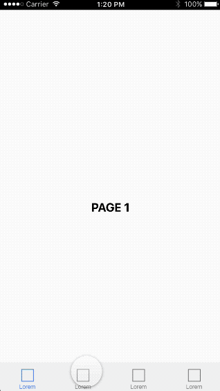

# framer-app-base
A Framer module to create the base of an app with a **flow component** and a **tab bar** menu. When you tap on a menu item, it animates the switch between pages in the direction of the new page.

##Installation
1. Download the `appBase.coffee` file
2. Create a Framer project and add the file in `/modules`
3. At the top of the Framer document write `base = require "appBase"`

##Usage
create a new object appBase with the following arguments
1. Array of layers for the different pages
2. the header layers
3. the tab bar layer. Its children are the tab elements. The tabs are layers initially in their **selected state** color, the module takes care of graying them out and keeping only the selected tab in color.

    new base.appBase([array of layers], header, menu)

##Example

    # Require the module
    base = require "appBase"

    # Create a series of layers that will become the pages
    layer1 = new Layer
    backgroundColor: "#ffffff"
    size: Screen.size
    text1 = new TextLayer
    text: "Page 1"
    textTransform: "uppercase"
    fontWeight: 700
    parent: layer1
    color: "#000000"
    x: Align.center
    y: Align.center

    layer2 = new Layer
    backgroundColor: "#ffffff"
    size: Screen.size
    text2 = new TextLayer
    text: "Page 2"
    textTransform: "uppercase"
    fontWeight: 700
    parent: layer2
    color: "#000000"
    x: Align.center
    y: Align.center

    layer3 = new Layer
    backgroundColor: "#ffffff"
    size: Screen.size
    text3 = new TextLayer
    text: "Page 3"
    textTransform: "uppercase"
    fontWeight: 700
    parent: layer3
    color: "#000000"
    x: Align.center
    y: Align.center

    layer4 = new Layer
    backgroundColor: "#ffffff"
    size: Screen.size
    text4 = new TextLayer
    text: "Page 4"
    textTransform: "uppercase"
    fontWeight: 700
    parent: layer4
    color: "#000000"
    x: Align.center
    y: Align.center

    # Create the header
    layerHeader = new Layer
    width: 750
    height: 40
    image: "images/statusbar.png"

    # Create the menu
    layerMenu = new Layer
    width: 750
    height: 103
    backgroundColor: "#f7f7f7"

    # Create the menu elements
    for i in [0...4]
    menuEl = new Layer
        parent: layerMenu
        width: 54
        height: 68
        image: "images/menuEL.png"
        y: 24
        x: 66 + 188*i

    # Create the app base
    new base.appBase([layer1,layer2,layer3,layer4], layerHeader, layerMenu)

##License
Framer-app-base is released under the MIT license.

##Contact
Twitter: [@benjarier](https://twitter.com/benjarier)
